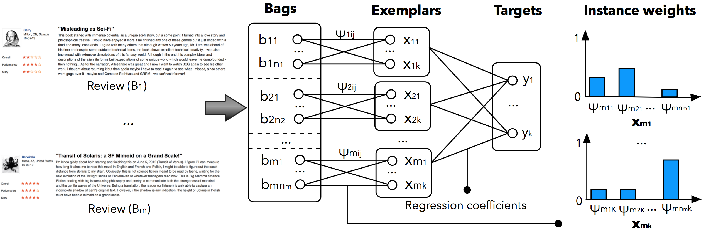
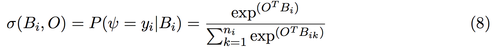
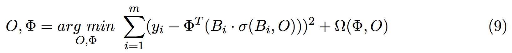

<p><b>wmil-sgd</b> —
This repository contains a Python implementation of the weighted multiple-instance learning (<a href="https://github.com/nik0spapp/wmil">wmil</a>) algorithm based on stochastic gradient descent which was presented at JAIR 2017 paper [<a href="http://publications.idiap.ch/downloads/papers/2017/Pappas_JAIR_2017.pdf">1</a>]. This algorithm, which was originally proposed at EMNLP 2014 paper [<a href="http://publications.idiap.ch/downloads/papers/2014/Pappas_EMNLP14_2014.pdf">2</a>], is a weakly supervised learning model, which jointly learns to focus on relevant parts of a document according to the context along with a classifier for the target categories. The model takes as input a document Bi (bag), which consists of multiple input vectors <i>b<sub>ij</sub></i> (instances), possibly from a neural network. The model learns to compute a weighted average of these vectors by estimating the weights <i>ψ<sub>ij</sub></i> for each document <i>B<sub>i</sub></i> and its target categories <i>y<sub>i</sub></i> <i>∈ R<sup>k</sup></i>.
<p align="center">

</p>
</p>

```
@ARTICLE{Pappas_JAIR_2017,
         author = {Pappas, Nikolaos and Popescu-Belis, Andrei},
          title = {Explicit Document Modeling through Weighted Multiple-Instance Learning},
        journal = {Journal of Artificial Intelligence Research},
           year = {2017},
            pdf = {http://publications.idiap.ch/downloads/papers/2017/Pappas_JAIR_2017.pdf}     
} 
```

Defining the learning objective
------------
The present code assumes that a document <i>B<sub>i</sub></i> is represented by a set of fixed sentence vectors. The instance relevance (attention) is modeled by a normalized exponential function, namely softmax and a linear activation between a contextual vector <i>O</i> and the sentence vectors <i>B<sub>i</sub></i> (document matrix):

<p align="right">

</p> 

The learning objective is formulated in the regularized least squares framework and can be optimized with stochastic
gradient descent (SGD) as it is comprised of differentiable functions.

<p align="right">

</p> 

Installing dependencies
------------
The available code requires Python programming language and pip package manager to run. 
For detailed instructions on how to install it along with a package manager please refer 
to the following links: http://www.python.org/getit/ and http://www.pip-installer.org/en/latest/.

Next, you should be able to install the following packages: <br />
```bash
$ pip install numpy 
$ pip install scikit-learn
$ pip install scipy
```

Training and testing the model
------------
The code extends BaseEstimator class from scikit-learn package, so you should be able to use it as a common sklearn estimator (check more details on http://scikit-learn.org/stable/). For example:
```bash
$ python
>>> import pickle
>>> from wmil_sgd import SGDWeights
>>> from sklearn.metrics import mean_absolute_error
>>> data = pickle.load(open('features/ted_comments.p'))
>>> size = len(data['X'])
>>> k = int(size*0.5)
>>> x_train = data['X'][:k]
>>> y_train = data['Y'][:k]
>>> x_test = data['X'][k:]
>>> y_test = data['Y'][k:]
>>> model = SGDWeights(alpha=0.4, momentum=0.0, minib=50)
>>> model.fit(x_train, y_train)
[+] Training...
epoch -> 0 / mae: 0.193162 (0.26 sec)
epoch -> 1 / mae: 0.188571 (0.26 sec)
epoch -> 2 / mae: 0.185567 (0.27 sec)
epoch -> 3 / mae: 0.182778 (0.27 sec)
epoch -> 4 / mae: 0.180144 (0.27 sec)
epoch -> 5 / mae: 0.177637 (0.28 sec)
epoch -> 6 / mae: 0.175247 (0.28 sec)
epoch -> 7 / mae: 0.172964 (0.29 sec)
epoch -> 8 / mae: 0.170796 (0.27 sec)
epoch -> 9 / mae: 0.168738 (0.28 sec)
...
>>> mean_absolute_error(model.predict(x_train),y_train) # training error
0.08907894272487181
>>> mean_absolute_error(model.predict(x_test), y_test) # testing error
0.16175043443941697
```
To have access to the estimated sentence relevance weights of one or more input documents you can use the function <code>predict_weights()</code>. The weights for a single input document can be obtained as follows:
```
>>> weights, preds = model.predict_weights([x_test[14]])
>>> print weights[0]
array([ 0.43081474,  0.31438322,  0.25480204])
>>> print preds[0]
0.84218349080557298
>>> print y_test[14].tolist()[0]
0.80000000000000000
```
For multiple input documents the relevance weights can be obtained as follows:
```
>>> weights, preds = model.predict_weights(x_test)
>>> print weights[14]
array([ 0.43081474,  0.31438322,  0.25480204])
>>> print preds[14]
0.84218349080557298
```


Visualizing the relevance weights
------------
The relevance weights estimated by the weighted multiple-instance learning model are useful for interpreting the decision made by the classifier for a particular task. For instance, the following example visualizes the estimated relevance weights (shown in percentage) of each sentence by the model in the task of sentiment analysis of comments. For more examples please check the online <a href="http://nik0spapp.github.io/demos/wmil-sa/">wmil-sa demo</a>.

<p align="center">
<a href="http://nik0spapp.github.io/demos/wmil-sa/"></a>
</p> 

Evaluating the relevance weights
------------
For an intrinsic evaluation of the relevance weights we created and used the <a href="http://www.idiap.ch/paper/hatdoc/">HATDOC dataset</a>. HATDOC contains human attention scores to sentences when attributing specific categories (aspect ratings) to documents (audiobook reviews). The annotations were obtained using at least 4 qualified judges per sentence using a crowdsourcing platform, namely 100 audiobook reviews with 1,662 sentences and three aspects: story, performance, and overall quality. In addition, a dataset of 50K audiobook reviews with document-level aspect ratings can be used for weakly supervised training. The data are suitable for intrinsic evaluation of explicit document modeling models with attention mechanisms in the task of aspect sentiment analysis and summarization of reviews.


